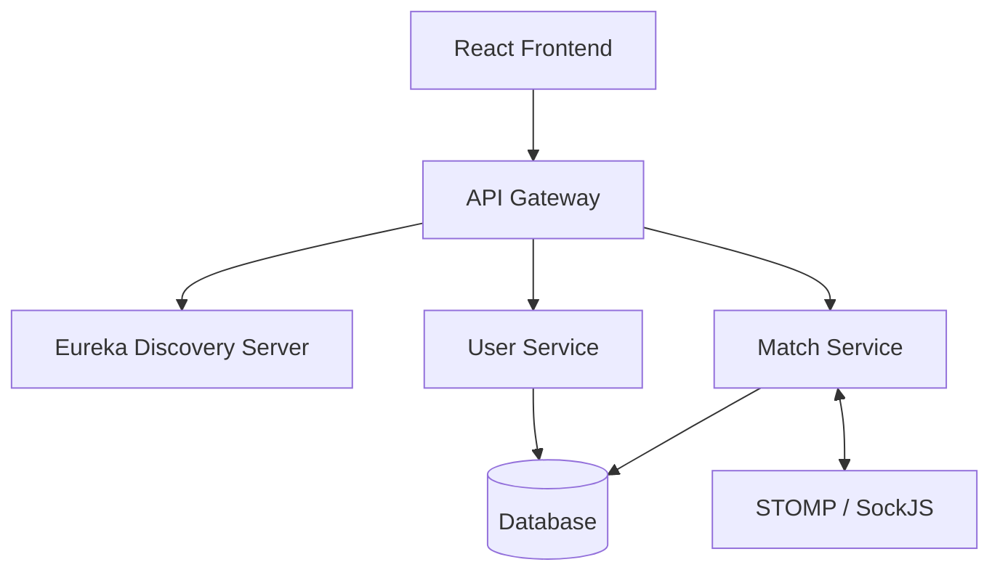

# ♟️ indiChess

[](https://www.oracle.com/java/technologies/javase/jdk21-archive-downloads.html)
[](https://spring.io/projects/spring-boot)
[](https://reactjs.org/)
[](LICENSE)

> **Experience Chess like never before.** A high-performance, real-time multiplayer chess platform built on a scalable microservices architecture.

---

## 🏗️ Architecture

indiChess is designed for scale and resilience using a microservices ecosystem:



---

## ✨ Features

- **⚡ Real-time Gameplay**: Seamless move synchronization via WebSockets (STOMP).
- **🤝 Automated Matchmaking**: Find opponents instantly with our dedicated Match Service.
- **🤖 Bot Matches**: Test your skills against AI-driven opponents.
- **🔐 Secure Authentication**: Integrated user management with token-based security.
- **📊 Live History**: Track every move and analyze your game in real-time.
- **⌛ Precise Timing**: Synchronized timers ensure fair play across sessions.

---

## 🛠️ Tech Stack

### **Backend (Spring Boot Microservices)**
| Component | Technology |
| :--- | :--- |
| **Discovery** | Spring Cloud Eureka |
| **Gateway** | Spring Cloud Gateway |
| **Core** | Java 21, Spring Boot 3.2.0 |
| **Real-time** | WebSockets + STOMP |
| **Tools** | Maven, Lombok |

### **Frontend (React)**
| Component | Technology |
| :--- | :--- |
| **Framework** | React 19 |
| **Routing** | React Router 7 |
| **State/API** | Axios |
| **Real-time** | @stomp/stompjs, SockJS |
| **Icons** | React Icons |

---

## 🚀 Getting Started

### Prerequisites
- **JDK 21** or later
- **Node.js 18+** & npm
- **Maven 3.8+**

### 1. Backend Setup
Navigate to the `backend` directory and build the project:
```bash
cd backend
mvn clean install
```

Start the services in order:
1. **Eureka Server**: Port 8761
2. **API Gateway**: Port 8080
3. **User Service** & **Match Service**

### 2. Frontend Setup
Navigate to the `indichessfrontend` directory:
```bash
cd indichessfrontend
npm install
npm start
```
The application will be available at `http://localhost:3000`.

---

## ❤️ Final Note

Built with dedication, curiosity, and continuous learning.  
**indiChess** is not just a project — it’s a step toward production-ready, real-time application development.
